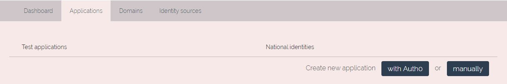
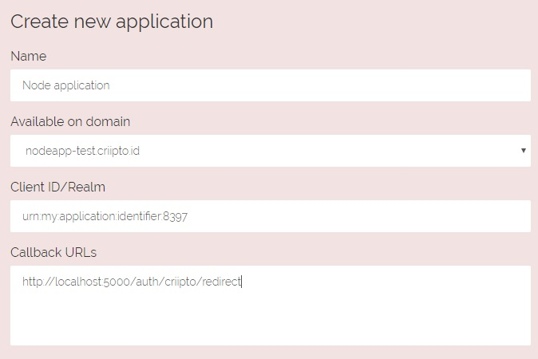
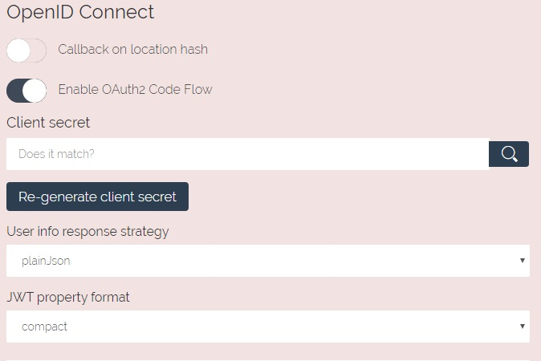

# Criipto authentication flow
This project will guide you in setting up Criipto authentication flow using Node.js, Express and Passport libraries. If you want to try out multiple authentication methods with user interface please check out "demo_react_app" branch in this repository. This application could be also accessible through here: [https://criiptodemo.herokuapp.com/](https://criiptodemo.herokuapp.com/)
*To try out authentication flow thoroughly test users are necessary. How to get them you could check it out here:* [Create or Get e-ID Test Users](https://docs.criipto.com/how-to/test-users/)

## Table of Contents
- [Run project locally](#run-project-locally)
- [Implementation](#implementation)
- [Register Your Application in Criipto Verify](#register-your-application-in-criipto-verify)
- [Configure the OAuth2 code flow](#configure-the-oauth2-code-flow)
- [Node.js application](#node.js-application)
- [Server](#server)
- [Application](#application)
- [Passport setup](#passport-setup)
- [Keys](#keys)
- [Routes](#routes)

## Run project locally
 To get this project up and running locally please follow these steps:
 1. Clone this repository to your machine
 2. Run `npm install`
 3. Create `keys.js` file in `/config` folder with following values:
  ```javascript
  criipto: {
      domain: '...',
      clientID: '...',
      clientSecret: '...',
  },
  session: {
    secret: '...'
  }
```
 4. Start server using nodemon `npm run watch`
 5. Visit [http://localhost:5000/auth/criipto](http://localhost:5000/auth/criipto) to initiate authentication flow

## Implementation
This section describes all the necessary steps in order to create such application from scratch using previously mentioned technologies.
Once you complete this guide you should be able to:
 1. Set up Criipto Verify account that would allow to use OpenID Connect in your application
 2. Implement Criipto authentication flow in your Node application
 3. Choose between different authentication methods

### Register Your Application in Criipto Verify
Assuming that you already have an account created with Criipto Verify you have to register an application on the platform to use any of the available e-IDs for authentication.\
First create a new tenant by clicking on menu in top-right corner of the screen. Choose any preferred  name which is available. *Do not worry setting up tenant could take a while*\


\Navigate to **Application** tab and create new application manually\



\Fill in blank fields. Specify **Domain** on which you will be communicating with Criipto Verify. **Client ID** will be used to identify your application, this value has to be unique. **Callback URLs** a link or a list of links where after successful authentication JSON Web token will be returned. Put each URL on a new line.\


\Choose desired authentication providers and click **Save**

### Configure the OAuth2 code flow
Once you have saved the configuration for you application open it again and you should see **OpenID Connect** options.
Select **Enable OAuth2 Code Flow**. Then you will be presented with client secret, note it down because it is shown only once, also you can always generate new client secret by clicking **Re-generate client secret**.\

For **User info response strategy** we will be using **plainJson**\



\After everything is set up click **Save**

### Node.js application
To create a Node.js application run `npm init` command.
Then for successful implementation four dependencies are required:
- express
- express-session
- passport
- passport-openidconnect

To install these dependencies run `npm install express express-session passport passport-openidconnect --save`

### Server
Create `server.js` in root project directory with following code:
```javascript
const app = require('./app') 
const http = require('http')

const server = http.createServer(app)
const port = 5000

server.listen(port, () => {
  console.log(`Server running on port ${port}`)
})
```

### Application
Create `app.js` file in root directory of the project. This file will contain most of the core application logic. 
First you need to import libraries and other files that will be used in the application. Even though `passportSetup` is not used in this file it necessary to include it in order to invoke the passport setup code
```javascript
const express = require('express')
const session = require('express-session')
const passport = require('passport')
const passportSetup = require('./config/passport-setup')
const keys = require('./config/keys')
```
Initialize application with express
```javascript
const app = express()
```
We will be using a session to store cookies
```javascript
app.use(session({
  secret: keys.session.secret,
  resave: false,
  saveUninitialized: true
}))
```
Initialize passport and let it know that we are using session
```javascript
app.use(passport.initialize())
app.use(passport.session())
```
We will be using `/auth` routes for our requests, lets initialize that
```javascript
const authRoutes = require('./routes/auth-routes')
app.use('/auth',authRoutes)
```
And lastly export the app object
```javascript
module.exports = app
```

### Passport setup
For passport setup we create new `config` folder and in that folder file named `passport-setup.js`\
Import required libraries:
```javascript
const passport = require('passport')
const OidcStrategy = require('passport-openidconnect').Strategy
const keys = require('./keys')
```
Then we set up passport `openidconnect` strategy. This is the part where `ClientID` `Domain` and `Client Secret` is used, all these values could be found under you application configuration in Criipto Verify platform.
`arc_values` defines what method of authentication we will be using. In this case it is Danish NemID. These are the possible values:
- Norwegian BankID\	 
 Mobile or Web (user choice): 	urn:grn:authn:no:bankid
---
- Norwegian Vipps Login\	 
  Login with Vipps app: 	urn:grn:authn:no:vipps
---
- Swedish BankID\	 
  Same device:	urn:grn:authn:se:bankid:same-device\
  Another device (aka mobile): 	urn:grn:authn:se:bankid:another-device\
---
- Danish NemID\
  Personal with code card: 	urn:grn:authn:dk:nemid:poces\
  Employee with code card: 	urn:grn:authn:dk:nemid:moces\
  Employee with code file: 	urn:grn:authn:dk:nemid:moces:codefile\
---
- Finish e-ID\ 
  BankID:	urn:grn:authn:fi:bankid\
  Mobile certificate (Mobiilivarmenne): 	urn:grn:authn:fi:mobile-id\
  Any of the two:	urn:grn:authn:fi:all\
---
\
```javascript
passport.use('oidc', new OidcStrategy({
  issuer: `https://${keys.criipto.domain}`,
  authorizationURL: `https://${keys.criipto.domain}/oauth2/authorize`,
  tokenURL: `https://${keys.criipto.domain}/oauth2/token`,
  userInfoURL: `https://${keys.criipto.domain}/oauth2/userinfo`,

  // login method (NemID)
  acr_values: 'urn:grn:authn:dk:nemid:poces',

  clientID: keys.criipto.clientID,
  clientSecret: keys.criipto.clientSecret,
  callbackURL: 'http://localhost:5000/auth/criipto/redirect',
  scope: 'openid profile'
}, (issuer, sub, profile, accessToken, refreshToken, done) => {
  return done(null, profile);
}))
```
Upon sucessful authentication user profile will be sent to redirect URL with all relevant information. This information will be stored under `request.user`.\ 
Lastly, passport serialization functionality allows to store and delete user from the session with these lines of code:
```javascript
passport.serializeUser((user, done)=> {
  done(null, user);
})

passport.deserializeUser((user, done)=> {
  done(null, user);
})
```

### Keys
We create another file under `config` folder called `keys.js`. This file will provide all required hardcoded strings for the application.
```javascript
module.exports = {
  criipto: {
      domain: '...',
      clientID: '...',
      clientSecret: '...',
  },
  session: {
    secret: '...'
  }
}
```

### Routes
Finally, we add `routes` folder in projects root directory and create `auth-routes.js` file. This file will handle all requests made to `http://localhost:5000/auth` route.\
Import necessary libraries:
```javascript
const router = require('express').Router()
const passport = require('passport');
```
Define authentication or login route `http://localhost:5000/auth/criipto` which invokes the authentication process
```javascript
router.get('/criipto', passport.authenticate('oidc'))
```
Define callback route. It could simply redirect user to desired path but in this example it returns the `user` object
```javascript
router.get('/criipto/redirect',passport.authenticate('oidc'),(req,res)=>{
  // return logged in user
  res.send(req.user)
})
```
And we export this route
```javascript
module.exports = router
```
After you successfully implemented all eight steps you can start the application and visit `http:/localhost:5000/auth/criipto` to begin the authentication process using your chosen method.